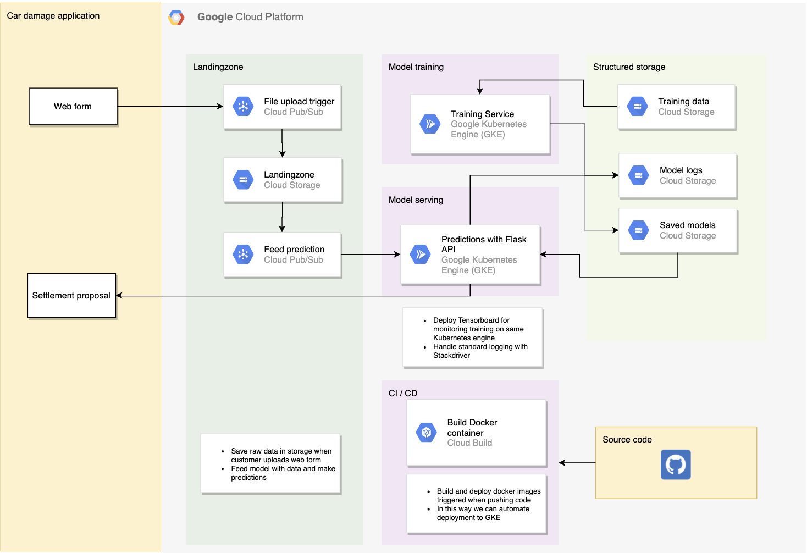

# Car damage detection

## Project Organization

```
.
├── README.md
├── __pycache__
│   └── dataset_utils.cpython-37.pyc
├── architecture_scatch.png
├── car_damage.ipynb
├── data
│   ├── images
│   └── mask_rcnn_coco.h5
├── dataset_utils.py
├── logs
│   ├── damage_detection20200618T2231
│   ├── damage_detection20200619T1526
│   ├── damage_detection20200619T1750
│   └── damage_detection20200621T1117
├── mrcnn
│   ├── __init__.py
│   ├── __pycache__
│   ├── cocoapi
│   ├── config.py
│   ├── model.py
│   ├── parallel_model.py
│   ├── utils.py
│   └── visualize.py
├── requirements.txt
└── venv
    ├── bin
    ├── etc
    ├── include
    ├── lib
    ├── man
    ├── pyvenv.cfg
    └── share

```

## Project setup & installation

### Prerequisites
The setup is tested on **MacOS** but should work without too much trouble on **Windows** environments.


### Project installation
1. Clone git repository to local repository
2. Create virtual environment and install the requirements.
```bash
$ python3.6 -m venv venv
$ source venv/bin/activate
$ pip install -r requirements.txt
```
Run jupyter:
```bash
$ jupyter notebook car_damage.ipynb
```

### Productionizing the model 



